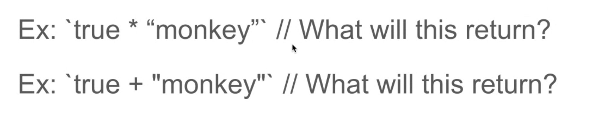

# Teach Your Peers JavaScript: freeCodeCamp Teach EloquentJS \(Chapters 8 & 9\)

## Chapter 8: Bugs and Errors

> **Anthony**

### Language

* Vague concepts of bindings and props is an issue in JavaScript

_Insert example_



### Strict Mode

JavaScript can be made a _little_ stricter by enabling _strict mode_. This is done by putting the string `"use strict"` at the top of the file...

### Types

A lot of mistakes come from being confused about the kind of value that goes into or comes out of a function.

TypeScript is one of the most popular tools for controlling and monitoring types with JavaScript. \(?\)

### Testing

How do we mitigate the looseness of JavaScript?

### Debugging

Use browser developer tools and `console.log()` to debug

Which tools?? How to write tests??

Jest

Mocha

Jasmine

### Error Propagation

Programmers can NOT stop all errors/problems.

How do you handle errors?

* Ignore them
* Report them to the user
  * Return:
    * null
    * undefined
    * -1
    * A special value \(i.e. an error message\)

### Exceptions

What to do when a function cannot proceed normally? Immediately jump to a place that knows how to handle the problem.

Raising/throwing an exception

#### Try/Catch

The `error` constructor creates an object with a `message` prop.

Benefits:

Function may ignore errors \(almost always\)

### Cleaning Up After Exceptions

Type of "Control Flow"

Add a finally block

* May follow or be used instead of a catch block
* Always runs after the try/catch block

### Selective Catching

The environment determines how errors are handled.

#### Raising exceptions

Invalid use of the JavaScript language

* Referencing a non-existent binding

#### All or Nothing

JavaScript has no direct support for selectively handling exceptions

* Catch 'em all
* Catch none

#### Blanket Catch — BAD

### Assertions

Checks inside a program to verify that "X" is the way it's supposed to be.

Used to handle programmer mistakes.

Makes it easier to find their causes.

### Resources






## Chapter 9: Regular Expressions

> **Anusha Venk**

Regular expressions are a way to describe patterns in string data. Regular expressions are both terribly awkward and extrememly useful.

But they are a powerful tool for inspecting and processing strings. Properly understanding regular expressions will make you a more effective programmer.

They form a small, separate language that is part of JavaScript and many other languages and systems.

### Creating A Regular Expression

A regular expression is a type of object. It can be either constructed with the `RegExp` constructor or written as a literal value by enclosing a pattern forward slash \(`/`\) characters:

```javascript
let re1 = new RegExp("abc");
let re2 = /abc/;
```

#### Meta Characters \(Need to be Escaped\)

```javascript
.[{()\^$|?*+
```

Meaning: when looking for these types of characters in a string as part of a matching pattern, this should be preceded by a backslash

### Testing for Matches


### Sets of Characters


### Repeating Parts of A Pattern


### Grouping Subexpressions


### Matches and Groups


### The Date Class


### Word and String Boundaries


### Choice Patterns


### The Mechanics of Matching


### Backtracking


### The Replace Method


### Greed


### Dynamically Creating RegExp Objects


### The Search Method


### The lastIndex Property


### Parsing an INI File


### International Characters


### Resources




