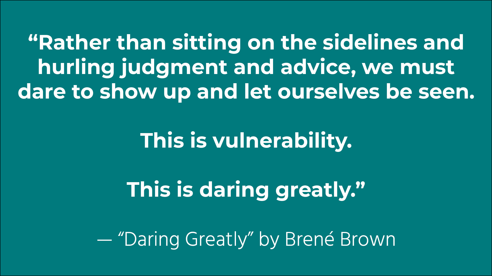

# Daring Greatly by Brené Brown

## My Notes & Highlights

### Introduction: My Adventures in the Arena

> Vulnerability is the core, the heart, the center, of meaningful human experiences. \(p. 12\)

> When shame becomes a management style, engagement dies. When failure is not an option we can forget about learning, creativity, and innovation. \(p.15\)

> _What we know matters, but who we are matters more._ Being rather than knowing requires showing up and letting ourselves be seen. \(p. 16\)

### **Chapter 1: Scarcity:** Looking Inside Our Culture of "Never Enough"

> What almost no one understands is how every level of severity in this diagnosis is underpinned by shame. Which means we don’t “fix it” by cutting people down to size and reminding folks of their inadequacies and smallness. Shame is more likely to be the cause of these behaviors, not the cure. \(p. 21\)

#### Looking at Narcissism Through the Lens of Vulnerability

> There are certainly instances when a diagnosis might be necessary if we are to find the right treatment, but I can’t think of one example where we don’t benefit by also examining the struggle through the lens of vulnerability. Something can always be learned when we consider these questions:
>
> 1. What are the messages and expectations that define our culture and how does culture influence our behaviors?
> 2. How are our struggles and behaviors related to protecting ourselves?
> 3. How are our behaviors, thoughts, and emotions related to vulnerability and the need for a strong sense of worthiness? \(p. 23–24\)

> There is a powerful cultural influence at play right now, and I think the fear of being ordinary is a part of it \(p. 24\)

#### Scarcity: The Never-Enough Problem

> In her book _The Soul of Money_, she refers to scarcity as “the great lie.” \(p. 25\)

The author of _The Soul of Money_ is global activist and fundraiser, Lynne Twist.

> Scarcity is the "never enough" problem. \(p. 25\)

#### The Source of Scarcity

> The world has never been an easy place, but the past decade has been traumatic for so many people that it’s made changes in our culture. From 9/11, multiple wars, and the recession, to catastrophic natural disasters and the increase in random violence and school shootings, we’ve survived and are surviving events that have torn at our sense of safety with such force that we’ve experienced them as trauma even if we weren’t directly involved. \(p. 27\)

> Worrying about scarcity is our culture’s version of post-traumatic stress. It happens when we’ve been through too much, and rather than coming together to heal \(which requires vulnerability\), we’re angry and scared and at each other’s throats. \(p. 27\)

This is **EXACTLY** what is happening right now!

> Scarcity bubbles up from these conditions and perpetuates them until a critical mass of people start making different choices and reshaping the smaller cultures they belong to. \(p. 27–28\)

> The larger culture is always applying pressure, and unless we’re willing to push back and fight for what we believe in, the default becomes a state of scarcity. \(p. 29\)

> The opposite of scarcity is enough, or what I call Wholeheartedness...Wholeheartedness, but at its very core is vulnerability and worthiness: facing uncertainty, exposure, and emotional risks, and knowing that I am enough. \(p. 29\)

> The one thing we have in common is that we’re sick of feeling afraid. We all want to be brave. \(p. 30\)

### **Chapter 2:** Debunking the Vulnerability Myths

#### MYTH \#1: “VULNERABILITY IS WEAKNESS.”

> The perception that vulnerability is weakness is the most widely accepted myth about vulnerability and the most dangerous. \(p. 33\)

> Vulnerability is the core of all emotions and feelings. To feel is to be vulnerable. To believe vulnerability is weakness is to believe that feeling is weakness. To foreclose on our emotional life out of a fear that the costs will be too high is to walk away from the very thing that gives purpose and meaning to living. \(p. 33\)

> **I define vulnerability as uncertainty, risk, and emotional exposure.** \(p. 34\)

> It starts to make sense that we dismiss vulnerability as weakness only when we realize that we’ve confused _feeling_ with _failing_ and _emotions_ with _liabilities_. \(p. 35\)

> _Vulnerability sounds like truth and feels like courage._ Truth and courage aren’t always comfortable, but they’re never weakness. \(p. 37\)

> We love seeing raw truth and openness in other people, but we’re afraid to let them see it in us. We’re afraid that our truth isn’t enough—that what we have to offer isn’t enough without the bells and whistles, without editing, and impressing. \(p. 41\)

> Here’s the crux of the struggle:  
> _I want to experience your vulnerability but I don’t want to be vulnerable.  
> Vulnerability is courage in you and inadequacy in me.  
> I’m drawn to your vulnerability but repelled by mine._ \(p. 41–42\)

> Vulnerability is life’s great dare. \(p. 43\)

#### MYTH \#2: “I DON’T DO VULNERABILITY”

> “If you choose not to decide, you still have made a choice.” \(p. 45\)

Lyric from Rush's song "Freewill."

#### MYTH \#3: VULNERABILITY IS LETTING IT ALL HANG OUT

> Sharing appropriately, with boundaries, means sharing with people with whom we’ve developed relationships that can bear the weight of our story. The result of this mutually respectful vulnerability is increased connection, trust, and engagement. \(p. 46\)

> We need to feel trust to be vulnerable and we need to be vulnerable in order to trust. \(p. 47\)

> Trust is a product of vulnerability that grows over time and requires work, attention, and full engagement. Trust isn’t a grand gesture—it’s a growing marble collection. \(p. 53\)

#### MYTH \#4: WE CAN GO IT ALONE

> _Going it alone_ is revered in our culture...the vulnerability journey is _not_ the kind of journey we can make alone. We need support. \(p. 53\)

> Nothing has transformed my life more than realizing that it’s a waste of time to evaluate my worthiness by weighing the reaction of the people in the stands. The people who love me and will be there regardless of the outcome are within arm’s reach. This realization changed everything. \(p. 56\)

### **Chapter 3:** Understanding and Combating Shame

> Yes, shame is tough to talk about. But the conversation isn’t nearly as dangerous as what we’re creating with our silence! We all experience shame. We’re all afraid to talk about it. And, the less we talk about it, the more we have it. \(p. 62\)

#### **What Is Shame and Why Is It So Hard to Talk About It?**

> _Shame is the intensely painful feeling or experience of believing that we are flawed and therefore unworthy of love and belonging._ \(p. 69\)

#### Untangling Shame, Guilt, Humiliation, and Embarrassment

> Guilt is just as powerful as shame, but its influence is positive, while shame’s is destructive. In fact, in my research I found that shame corrodes the very part of us that believes we can change and do better. \(p. 72\)

> Humiliation feels terrible and makes for a miserable work or home environment—and if it’s ongoing, it can certainly become shame if we start to buy into the messaging. It is, however, still better than shame. Rather than internalizing the “loser” comment, John’s saying to himself, “This isn’t about me.” When we do that, it’s less likely that we’ll shut down, act out, or fight back. We stay aligned with our values while trying to solve the problem. \(p. 73–74\)

> The hallmark of embarrassment is that when we do something embarrassing, we don’t feel alone. We know other folks have done the same thing and, like a blush, it will pass rather than define us. \(p. 74\)

#### I Get It. Shame Is Bad. So What Do We Do About It?

> Shame resilience is about moving from shame to empathy—the real antidote to shame.
>
> If we can share our story with someone who responds with empathy and understanding, shame can’t survive. Self-compassion is also critically important, but because shame is a social concept—it happens between people—it also heals best between people. A social wound needs a social balm, and empathy is that balm. Self-compassion is key because when we’re able to be gentle with ourselves in the midst of shame, we’re more likely to reach out, connect, and experience empathy. \(p. 74–75\)

> Here are the four elements of shame resilience:
>
> 1. **Recognizing shame and understanding its triggers.**
> 2. **Practicing critical awareness.**
> 3. **Reaching out.**
> 4. **Speaking shame.** \(p. 75\)

> When we bury the story we forever stay the subject of the story. If we own the story we get to narrate the ending. \(p. 80\)

#### Webs and Boxes: How Men and Women Experience Shame Differently

> What I’ve come to believe about men and women now that I’ve studied both is that men and women are equally affected by shame. The messages and expectations that fuel shame are most definitely organized by gender, but the experience of shame is universal and deeply human. \(p. 85\)

#### Women and the Shame Web

> Society views womanhood and motherhood as inextricably bound; therefore our value as women is often determined by where we are in relation to our roles as mothers or potential mothers. \(p. 86–87\)

#### How Men Experience Shame

> Basically, men live under the pressure of one unrelenting message: Do not be perceived as weak. \(p. 92\)

#### Pissed Off or Shut Down

> I don't want to oversimplify something as complex as the response to shame, but I have to say that when it comes to men, there seem to be two primary responses: pissed off or shut down. \(p. 96\)

#### I'm Only as Hard on Others as I Am on Myself

> Women can also be very hard on other women. \(p. 98\)

> What’s ironic \(or perhaps natural\) is that research tells us that we judge people in areas where we’re vulnerable to shame, especially picking folks who are doing worse than we’re doing. \(p. 99\)

> We’re hard on each other because we’re using each other as a launching pad out of our own perceived shaming deficiency. \(p. 99\)

> Adults are being asked to model the Wholeheartedness that they want to see in the children.
>
> There is a quiet transformation happening that is moving us from “turning on each other” to “turning toward each other.” \(p. 101\)

#### It's Not About the Back Fat: Men, Women, Sex, and Body Image

> I guess the secret is that sex is terrifying for most men. \(p. 103\)

> When I asked men, women, and couples how they practiced Wholeheartedness around these very sensitive and personal issues, one answer came up again and again: honest, loving conversations that require major vulnerability. We have to be able to talk about how we feel, what we need and desire, and we have to be able to listen with an open heart and an open mind. There is no intimacy without vulnerability. Yet another powerful example of vulnerability as courage. \(p. 103–104\)

#### Becoming Real

> When looking at the attributes associated with masculinity in the US, the same researchers identified the following: winning, emotional control, risk-taking, violence, dominance, playboy, self-reliance, primacy of work, power over women, disdain for homosexuality, and pursuit of status. \(p. 107\)

> Shame is universal, but the messages and expectations that drive shame are organized by gender. These feminine and masculine norms are the foundation of shame triggers...If women want to play by the rules, they need to be sweet, thin, and pretty, stay quiet, be perfect moms and wives, and not own their power...Men, on the other hand, need to stop feeling, start earning, put everyone in their place, and climb their way to the top or die trying. \(p. 107\)

> I think it’s important to add that for men there’s also a cultural message that promotes homophobic cruelty. If you want to be masculine in our culture, it’s not enough to be straight— you must also show an outward disgust toward the gay community. \(p. 107–108\)

> Asking members to dislike, disown, or distance themselves from another group of people as a condition of “belonging” is always about control and power. \(p. 108\)

> When I talk to men and women with high levels of shame resilience, they are keenly aware of these lists. They keep those strictures in mind so that when shame starts creeping up on them, or they find themselves fully in shame, they can reality-check these “norms,” thus practicing the second element of shame resilience—critical awareness. Basically, they can choose consciously not to play along. \(p. 108\)

> As I look back on what I’ve learned about shame, gender, and worthiness, the greatest lesson is this: If we’re going to find our way out of shame and back to each other, vulnerability is the path and courage is the light. To set down those lists of what we’re supposed to be is brave. To love ourselves and support each other in the process of becoming real is perhaps the greatest single act of daring greatly. \(p. 110\)

### **Chapter 4:** The Vulnerability Armory

> _Vulnerability is the last thing I want you to see in me, but the first thing I look for in you._ \(p. 113\)

#### The "Enough" Mandate

> It appears that believing that we’re “enough” is the way out of the armor—it gives us permission to take off the mask. With that sense of “enough” comes an embrace of worthiness, boundaries, and engagement. \(p. 116\)

> The three forms of shielding that I am about to introduce are what I refer to as the “common vulnerability arsenal” because I have found that we all incorporate them into our personal armor in some way. These include **foreboding joy**, or the paradoxical dread that clamps down on momentary joyfulness; **perfectionism**, or believing that doing everything perfectly means you’ll never feel shame; and **numbing**, the embrace of whatever deadens the pain of discomfort and pain. Each shield is followed by “Daring Greatly” strategies, all variants on “being enough” that have proved to be effective at disarming the three common forms of shielding. \(p. 117\)

#### The Common Vulnerability Shields

#### The Shield: Foreboding Joy

> I’d argue that joy is probably the most difficult emotion to really feel. Why? Because when we lose the ability or willingness to be vulnerable, joy becomes something we approach with deep foreboding. This shift from our younger self’s greeting of joy with unalloyed delight happens slowly and outside of our awareness. We don’t seem to even know that it’s happening or why. We just know that we crave more joy in our lives, that we are joy starved. \(p. 117–118\)

> We’re always waiting for the other shoe to drop. \(p. 118\)

#### Daring Greatly: Practicing Gratitude

> The shudder of vulnerability that accompanies joy is an invitation to practice gratitude, to acknowledge how truly grateful we are for the person, the beauty, the connection, or simply the moment before us. Gratitude, therefore, emerged from the data as the antidote to foreboding joy. \(p. 123\)

> Participants described happiness as an emotion that’s connected to circumstances, and they described joy as a spiritual way of engaging with the world that’s connected to practicing gratitude. \(p. 123\)

> **Joy comes to us in moments—ordinary moments. We risk missing out on joy when we get too busy chasing down the extraordinary.** Scarcity culture may keep us afraid of living small, ordinary lives, but when you talk to people who have survived great losses, it is clear that joy is not a constant. \(p. 125\)

> **Be grateful for what you have.** Don’t apologize for what you have. Be grateful for it and share your gratitude with others. _When you honor what you have, you’re honoring what I’ve lost._ \(p. 125\)

> **Don’t squander joy.** We can’t prepare for tragedy and loss. When we turn every opportunity to feel joy into a test drive for despair, we actually diminish our resilience. \(p. 126\)

#### The Shield: Perfectionism

> Healthy striving is self- focused: How can I improve? Perfectionism is other-focused: What will they think? Perfectionism is a hustle. \(p. 129\)

#### Daring Greatly: Appreciating the Beauty of Cracks

### **Chapter 5: Mind the Gap: Cultivating Change and Closing the Disengagement Divide**

### **Chapter 6: Disruptive Engagement: Daring to Rehumanize Education and Work**

### **Chapter 7: Wholehearted Parenting: Daring to Be the Adults We Want Our Children to Be**

## Discussion Slides



## Further Resources

### People and Works Mentioned in the Book

* John Gottman --&gt; scholar in the field of relationships
* _The Soul of Money_ by Lynne Twist

### Self-Compassion Quiz by Dr. Kristin Neff



### The Engaged Feedback Checklist



### The Confidence Code: The Science and Art of Self-Assurance—What Women Should Know by Katty Kay



