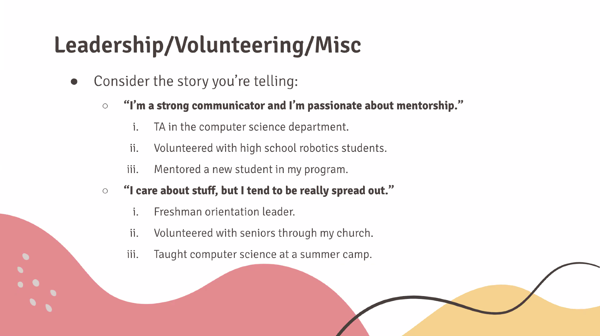
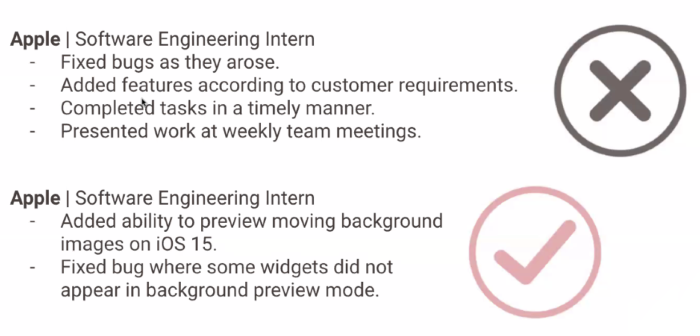
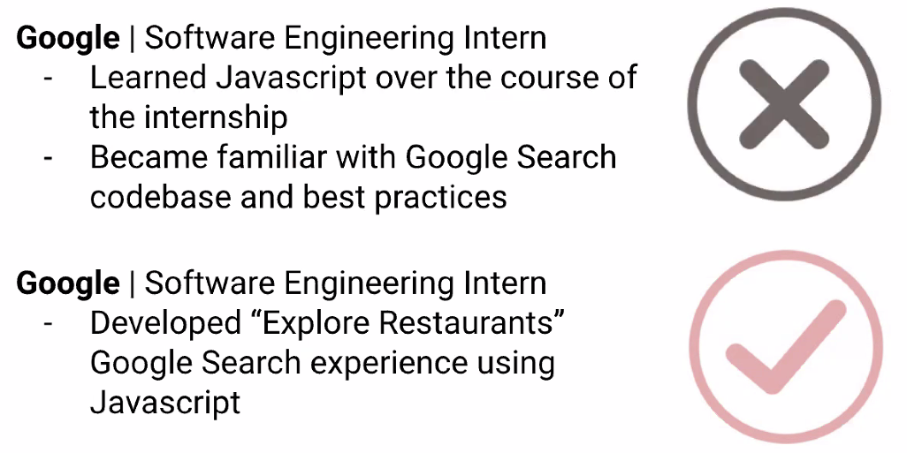
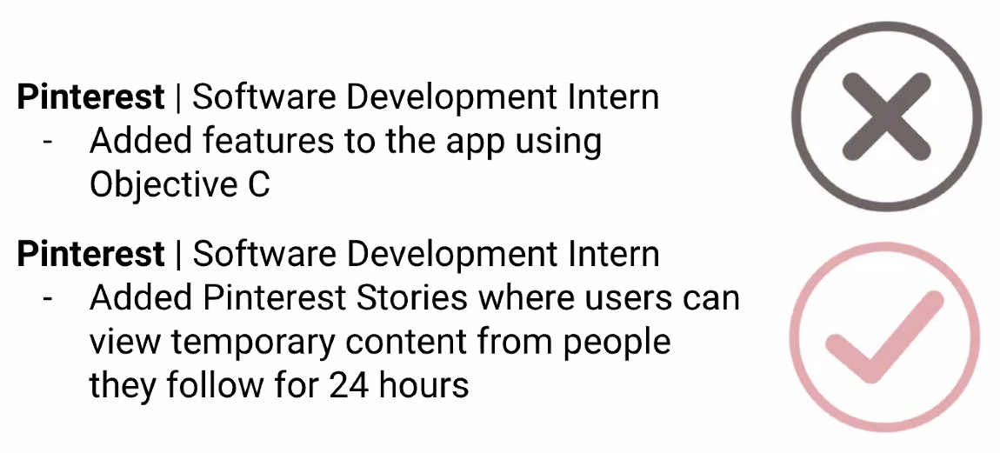
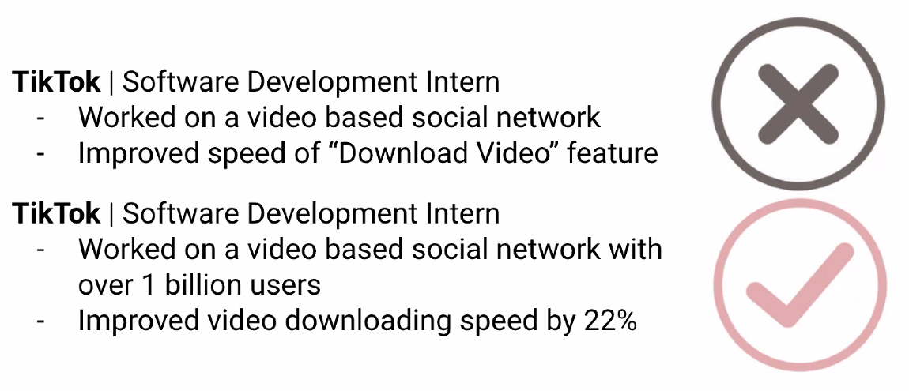
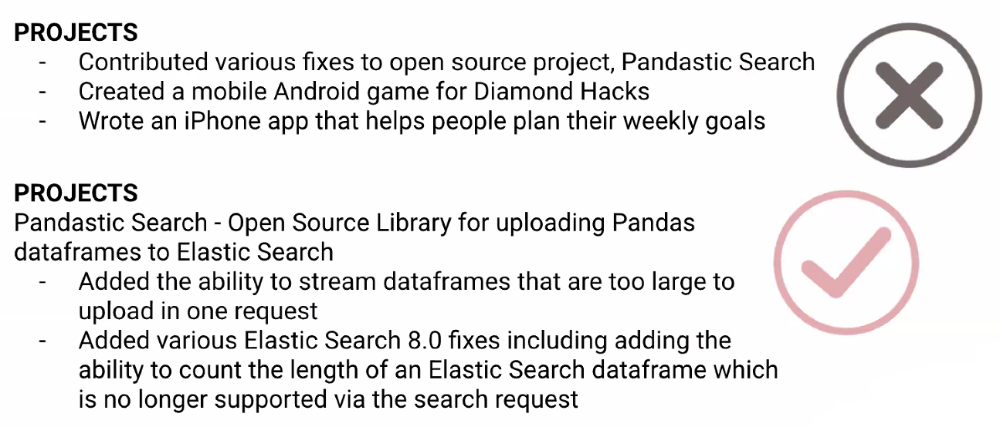
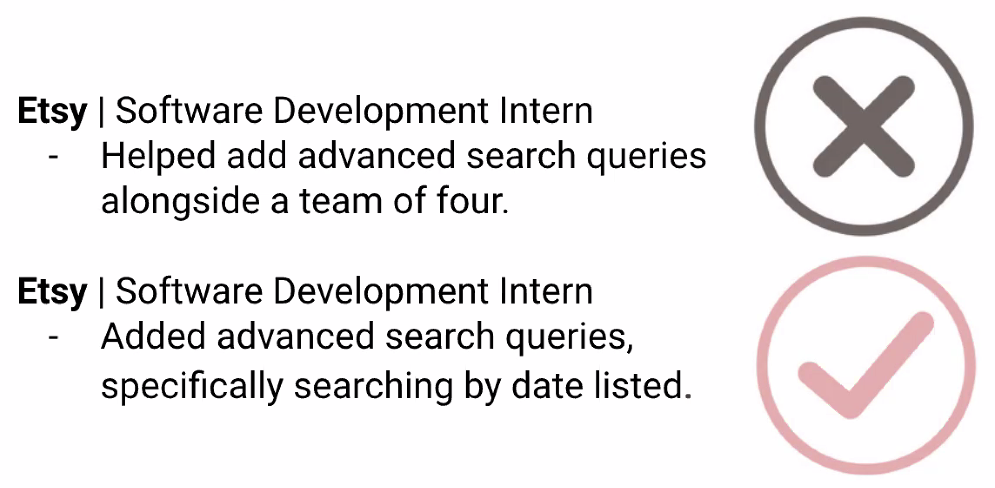

# Engineering Your Resume

> **Jessie Newman  
> @jessiedotjs**

1. What goes on a resume?
2. Format of a resume
3. How to describe your technical experience
4. Common resume myths and tips
5. Questions

_\*This is a US-centric view on resumes_

## What goes on a resume?

Companies want to hire someone who will... 

* Make the company money
* Make the company's products better
* Make people's jobs easier
* Be enjoyable to work with

The content on your resume should be:

* **Recent** --&gt; Remove out of date projects
* **Relevant** to the position you're applying to
  * Directly relevant to the job \(programming\) --&gt; 80%
  * Indirectly relevant \(soft skills\) --&gt; 20%
* **Clear** to read with little to no context

Every line should tell me something I don't already know.

### What are you allowed to put on your resume?

Anything!

* Both paid and unpaid work
* Both personal and school projects
* Both professional sounding projects and "silly" projects

## Format of a resume

1. Name and contact info
2. Objective
3. Education
4. Work experience and/or projects
5. Skills
6. Other \(leadership, volunteering, etc.\)

### Name and Contact Info

* Name
* Phone number
* Email
* Address... maybe
  * Include city and state if you're applying for a job in your city
  * Don't include address if the company will have to pay for relocation

### Objective

* Provide context --&gt; "just graduated from Flatiron School," "career changer"

### Education

* Include GPA if it is above a 3.0
* Include related coursework if it's _actually_ relevant

### Work Experience and/or Projects

* What is the **impact** of the information in this section?
* Be specific/detailed when describing job duties
  * Drop keywords --&gt; Which languages, frameworks, tools, etc. did you use in your line of work?
  * Use metrics to describe achievements

### Skills

* Keep it organized!
* Order by proficiency \(left to right\)
* Show, don't tell—especially soft skills
* Back up your skills in other sections

#### Example:

**Languages:** Python, JavaScript, HTML, CSS  
**Libraries:** jQuery, Pandas, Numpy  
**Tools:** Git, Sketch, Google AppEngine

### Other \(Leadership, Volunteering, etc.\)

Tailor your experiences to paint a picture.

## Describe Your Technical Experience

1. Don't tell me your job responsibilities, tell me what you accomplished.
2. Don't tell me what you learned, tell me what you did with that knowledge.
3. Explain your projects clearly and in detail.
   1. Help me understand why you are building it.
   2. Help me picture the result
4. Show impact by including numbers wherever possible.
5. Quality over quantity.
   1. I'd rather read 3 lines about 1 project than 1 line each about 3 projects.
6. Use strong language.
   1. "Implemented" rather than "Helped implement."

### Don't tell me your job responsibilities, tell me what you accomplished.

### Don't tell me what you learned, tell me what you did with that knowledge.

### Explain your projects clearly and in detail.

### Show impact by including numbers wherever possible.

### Quality over quantity.

### Use strong language.

## Resume Myths and Tips

**Myth:** Recruiters and hiring managers spend many minutes looking at your resume.  
**Tip:** Your resume should stand out even if someone only has 10 seconds to read it.

**Myth:** Recruiters and hiring managers will always click through to your GitHub and portfolio.  
**Tip:** Include details about your projects on your resume.

**Myth:** "Resume speak" is important to sound professional on a resume.  
**Tip:** Explain your projects mostly the same way you would explain them to a friend.

**Myth:** You can submit the same resume to every role you apply to.  
**Tip:** Have a different resume for at least every role \(software engineering, data analytics, QA\).

